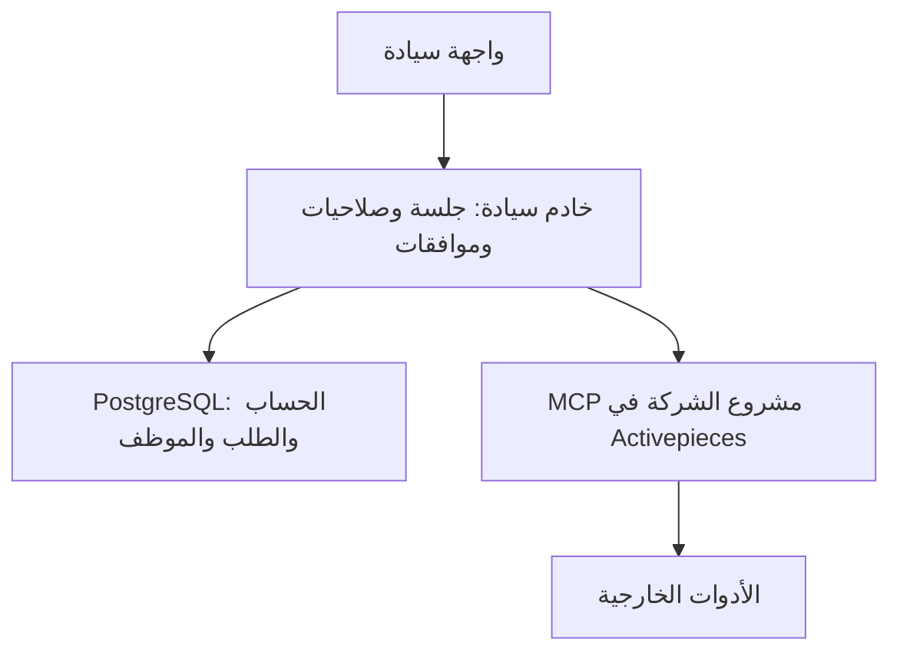

# خريطة سيادة الحالية

هذه خريطة عمل داخل `ALKHANFAR/t43` بتاريخ 2 أكتوبر 2026. راجع SHA خدمة Railway والفرع وLinear قبل التعديل؛ لا يُستمد وضع الإنتاج من اسم فرع محلي. مستودع `77766` مستبعد من هذا المسار. كود منصة Activepieces منفصل عن كود سيادة.

سيادة تملك هوية العميل، صلاحياته، الموافقات، البيانات التي يراها، ومعنى النتيجة. Activepieces ينفذ خلف خادم سيادة؛ لا يحدد المتصفح مشروع التنفيذ أو اتصال شركة أخرى. HTTP 202 يعني قبول طلب في طبقة API فقط. المسودة، اتصال الأداة، الاختبار، `runId`، نتيجة المزود، والنتيجة التي يراها العميل أدلة مختلفة.

| الجزء | مرجع اليوم | مالك التغيير |
| --- | --- | --- |
| تصميم كل صفحة | Figma بعد التحقق من الملف القابل للتعديل؛ ملفات `design/` معاينات توضيحية | A: التصميم والواجهة |
| واجهة المنتج | `auth.html`، `app/onboard.*`، `app/chat.*` | A: الحالات والنصوص والتفاعل عبر عقد API |
| API والعقود | `server.mjs`، `CHAT_CONTRACT.md` | B: الطلب والرد والصلاحيات؛ تراجع A وC أي تغيير مشترك |
| الحساب ونطاق الشركة | `lib/account-auth.mjs`، `lib/tenant-session.mjs` | B: الهوية والجلسة والعزل |
| بيانات الشركة والموظف | `lib/company-profile.mjs` وPostgreSQL | B: التخزين والمخطط والصلاحيات |
| قاعدة البيانات | `migrations/`، `scripts/migrate-schema.mjs`، `railway.json` | B: ترحيل قابل للتحقق قبل نشر الخدمة |
| التنفيذ | `lib/tenant-projects.mjs`، `lib/tool-connections.mjs`، `lib/activepieces-mcp.mjs` | C: مشروع الشركة والاتصالات والتدفقات وقراءة التشغيل؛ تغييرات SQL يراجعها B |
| قائمة الوصول المبكر | `lib/public-waitlist.mjs`، `migrations/0004-public-waitlist.sql` | B: طلب محفوظ 90 يومًا؛ نموذج LWS العام لم يتحول بعد |
| دليل Google | `docs/google-review/`، [ABO-62](https://linear.app/abo-eyad/issue/ABO-62/tjhyz-sfhh-syadh-alaamh-wsyash-gmail-lqbwl-google) | B وC مع مراجعة المحتوى العام قبل التقديم |

## طريقة الوصول والعمل

ابدأ باسم الميزة كما يراه العميل: `node scripts/feature-index.mjs "اسم الميزة"`. يربط `FEATURE_INDEX.md` و`features/index.json` النص الذي يبحث عنه العميل بملف الواجهة وAPI والعقد والترحيل والاختبار وقضية Linear. إن لم تظهر الميزة، استخدم `rg` ثم أضفها للفهرس في نفس تغييرها.

المسارات A وB وC تعمل في فروع و`worktrees` مستقلة، ولكل مهمة قضية في مشروع Linear الأصلي `P-ABO-2`. يحدد مالك التغيير الملفات المشتركة قبل الكتابة، ويُراجع العقد في [ABO-37](https://linear.app/abo-eyad/issue/ABO-37/twthyq-aqd-wajhh-t43-alhalat-waltlbat-walrdwd). يدمج مالك التكامل طلبات الدمج بترتيب اعتمادها في **الفرع الذي تنشره Railway بعد التحقق منه**. لا يكتب مساران في الملف نفسه في الوقت نفسه؛ عند تعارض العقد يُحسم أولًا في PR المالك ثم يُحدَّث الفرع التابع.

مثال التوازي: A تصمم حالة ربط Gmail وتبني العرض على العقد الحالي؛ B يحدد إشعار الخصوصية وعقد الاتصال والصلاحية؛ C يتحقق من اتصال الشركة ونتيجة التشغيل في مشروعها. تغيير حقل مشترك يبدأ من B ويراجعه A وC قبل الدمج. هذه العملية تقلل التعارض ولا تضمن انعدامه.

`npm test` بوابة محلية. عند قراءة 2 أكتوبر لم تبدأ مهام GitHub Standards بسبب قفل الفوترة، لذلك لا تُسمى ناجحة. وثّق نتيجة الاختبار المحلية ومراجعة التغيير في القضية. خدمة التطبيق المنشورة ليست الموقع العام لدى LWS؛ راجع [بوابات Google والموقع](docs/google-review/release-gates.md) قبل أي ادعاء عن الصفحة العامة.

## لقطة التوحيد: 7 أكتوبر 2026

فرع التغييرات الوحيد `codex/siyadah-consolidation-20261007`، ضمن PR #62. تحقّق Railway بالقراءة من أن خدمة `siyadah-direct-ui` تنشر `codex/abo-38-isolation-gate-20261001` عند `a130a59`؛ هذه لقطة مؤرخة وليست ضمانًا للرأس الحالي. بقية الأنظمة قراءة فقط أثناء هذه المهمة.

للمبرمج: ابدأ بـ `FEATURE_INDEX.md` واسم الميزة، ثم عقد `CHAT_CONTRACT.md`، ثم موضعها في الجدول أعلاه. `server.mjs` يربط HTTP والجلسة وسياق النموذج وسياسة استدعاء الأدوات؛ `lib/activepieces-mcp.mjs` يدير جلسة MCP؛ `lib/chat-outcome.mjs` يميز الأدلة والنتائج؛ `lib/company-profile.mjs` يسجل الطلبات والموظفين. لا تنقل تنفيذ الأدوات من Activepieces إلى سيادة عند تقسيم الملفات.

أزيل من فرع التوحيد فقط ملف اكتشاف Pilot غير المستدعى واختباراه (مخاطر حذف مقدّرة 1/10). وأزيل مسار `/deepseek/v1/chat/completions` غير المرتبط بجلسة شركة: لم يجد بحث المراجع مستهلكًا داخليًا، والمختبر المحلي يستخدم مزوده مباشرة (مخاطر حذف مقدّرة 3/10 بسبب المستهلكين الخارجيين غير الموثقين). الدرجات تقدير هندسي وليست نسبة احتمال. شات العملاء ومختبر التطوير باقيان.

لم يكتمل نقل كل المميزات أو تقسيم `server.mjs`. فصل اتصال مستخدم في تدفق من PR #38، ومراجعة التزامن عبر محادثات متعددة من PR #44، وسياق الموظف من PR #37 تحتاج مراجعة إضافية. لا يُعتمد اختبار مزود حي دون تصريح لاحق يسمح بالتأثيرات خارج GitHub. نجاح الاختبارات المحلية لا يثبت نتيجة لدى المزود.
