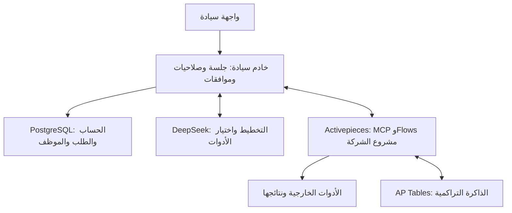

# خريطة سيادة الحالية

هذه خريطة عمل داخل `ALKHANFAR/t43` بتاريخ 8 أكتوبر 2026. راجع SHA خدمة Railway والفرع وLinear قبل التعديل؛ لا يُستمد وضع الإنتاج من اسم فرع محلي. مستودع `77766` مستبعد من هذا المسار. كود منصة Activepieces منفصل عن كود سيادة.

الشات الرئيسي وشات الموظف يستخدمان حلقة واحدة؛ القسم والدور والتعليمات ومعرفة الشركة تغيّر السياق والخطة، ولا تنشئ مسار تنفيذ مستقلًا لكل قسم. سيادة تجمع السياق وتتحقق من الأدلة؛ DeepSeek يخطط ويختار من كتالوج MCP الأصلي؛ Activepieces يملك التدفقات والأدوات والتنفيذ. بيانات الحسابات والموظفين والمحادثات الحالية في PostgreSQL، والذاكرة التراكمية الجديدة في AP Tables. نقل معرفة الشركة الحالية من SQL إلى AP لم يكتمل.

سيادة تملك هوية العميل، صلاحياته، الموافقات، البيانات التي يراها، ومعنى النتيجة. Activepieces ينفذ خلف خادم سيادة؛ لا يحدد المتصفح مشروع التنفيذ أو اتصال شركة أخرى. HTTP 202 يعني قبول طلب في طبقة API فقط. المسودة، اتصال الأداة، الاختبار، `runId`، نتيجة المزود، والنتيجة التي يراها العميل أدلة مختلفة.

| الجزء | مرجع اليوم | مالك التغيير |
| --- | --- | --- |
| تصميم كل صفحة | Figma بعد التحقق من الملف القابل للتعديل؛ ملفات `design/` معاينات توضيحية | A: التصميم والواجهة |
| واجهة المنتج | `auth.html`، `app/onboard.*`، `app/chat.*` | A: الحالات والنصوص والتفاعل عبر عقد API |
| API والعقود | `server.mjs`، `CHAT_CONTRACT.md` | B: الطلب والرد والصلاحيات؛ تراجع A وC أي تغيير مشترك |
| الحساب ونطاق الشركة | `lib/account-auth.mjs`، `lib/tenant-session.mjs` | B: الهوية والجلسة والعزل |
| بيانات الشركة والموظف | `lib/company-profile.mjs` وPostgreSQL | B: التخزين والمخطط والصلاحيات |
| قاعدة البيانات | `migrations/`، `scripts/migrate-schema.mjs`، `railway.json` | B: ترحيل قابل للتحقق قبل نشر الخدمة |
| التفكير والسياق | `server.mjs`، `lib/knowledge-context.mjs`، DeepSeek | B: تعليمات الموظف ومعرفة الشركة؛ لا عقل مستقل لكل قسم |
| الذاكرة التراكمية | `lib/cumulative-memory.mjs` وAP Tables | B وC: المصدر والنطاق والتحديث والتحقق؛ ليست قاعدة SQL جديدة |
| التنفيذ | `lib/tenant-projects.mjs`، `lib/tool-connections.mjs`، `lib/activepieces-mcp.mjs` | C: مشروع الشركة والاتصالات والتدفقات وقراءة التشغيل؛ تغييرات SQL يراجعها B |
| قائمة الوصول المبكر | `lib/public-waitlist.mjs`، `migrations/0004-public-waitlist.sql` | B: طلب محفوظ 90 يومًا؛ نموذج LWS العام لم يتحول بعد |
| دليل Google | `docs/google-review/`، [ABO-62](https://linear.app/abo-eyad/issue/ABO-62/tjhyz-sfhh-syadh-alaamh-wsyash-gmail-lqbwl-google) | B وC مع مراجعة المحتوى العام قبل التقديم |

## طريقة الوصول والعمل

ابدأ باسم الميزة كما يراه العميل: `node scripts/feature-index.mjs "اسم الميزة"`. يربط `FEATURE_INDEX.md` و`features/index.json` النص الذي يبحث عنه العميل بملف الواجهة وAPI والعقد والترحيل والاختبار وقضية Linear. إن لم تظهر الميزة، استخدم `rg` ثم أضفها للفهرس في نفس تغييرها.

المسارات A وB وC تعمل في فروع و`worktrees` مستقلة، ولكل مهمة قضية في مشروع Linear الأصلي `P-ABO-2`. يحدد مالك التغيير الملفات المشتركة قبل الكتابة، ويُراجع العقد في [ABO-37](https://linear.app/abo-eyad/issue/ABO-37/twthyq-aqd-wajhh-t43-alhalat-waltlbat-walrdwd). يدمج مالك التكامل طلبات الدمج بترتيب اعتمادها في **الفرع الذي تنشره Railway بعد التحقق منه**. لا يكتب مساران في الملف نفسه في الوقت نفسه؛ عند تعارض العقد يُحسم أولًا في PR المالك ثم يُحدَّث الفرع التابع.

مثال التوازي: A تصمم حالة ربط Gmail وتبني العرض على العقد الحالي؛ B يحدد إشعار الخصوصية وعقد الاتصال والصلاحية؛ C يتحقق من اتصال الشركة ونتيجة التشغيل في مشروعها. تغيير حقل مشترك يبدأ من B ويراجعه A وC قبل الدمج. هذه العملية تقلل التعارض ولا تضمن انعدامه.

`npm test` بوابة محلية. عند قراءة 2 أكتوبر لم تبدأ مهام GitHub Standards بسبب قفل الفوترة، لذلك لا تُسمى ناجحة. وثّق نتيجة الاختبار المحلية ومراجعة التغيير في القضية. خدمة التطبيق المنشورة ليست الموقع العام لدى LWS؛ راجع [بوابات Google والموقع](docs/google-review/release-gates.md) قبل أي ادعاء عن الصفحة العامة.

## لقطة التوحيد: 7 أكتوبر 2026

فرع التغييرات الوحيد `codex/siyadah-consolidation-20261007`، ضمن PR #62. تحقّق Railway بالقراءة من أن خدمة `siyadah-direct-ui` تنشر `codex/abo-38-isolation-gate-20261001` عند `a130a59`؛ هذه لقطة مؤرخة وليست ضمانًا للرأس الحالي. بقية الأنظمة قراءة فقط أثناء هذه المهمة.

للمبرمج: ابدأ بـ `FEATURE_INDEX.md` واسم الميزة، ثم عقد `CHAT_CONTRACT.md`، ثم موضعها في الجدول أعلاه. `server.mjs` يربط HTTP والجلسة وسياق النموذج وسياسة استدعاء الأدوات؛ `lib/activepieces-mcp.mjs` يدير جلسة MCP؛ `lib/chat-outcome.mjs` يميز الأدلة والنتائج؛ `lib/company-profile.mjs` يسجل الطلبات والموظفين. لا تنقل تنفيذ الأدوات من Activepieces إلى سيادة عند تقسيم الملفات.

أزيل من فرع التوحيد فقط ملف اكتشاف Pilot غير المستدعى واختباراه (مخاطر حذف مقدّرة 1/10). وأزيل مسار `/deepseek/v1/chat/completions` غير المرتبط بجلسة شركة: لم يجد بحث المراجع مستهلكًا داخليًا، والمختبر المحلي يستخدم مزوده مباشرة (مخاطر حذف مقدّرة 3/10 بسبب المستهلكين الخارجيين غير الموثقين). الدرجات تقدير هندسي وليست نسبة احتمال. شات العملاء ومختبر التطوير باقيان.

لم يكتمل نقل كل المميزات أو تقسيم `server.mjs`. التحقق الحي من فصل الاتصال المستخدم، والتحقق عبر PostgreSQL فعلي من التزامن بين المحادثات، وسياق الموظف من PR #37 تحتاج مراجعة إضافية. لا يُعتمد اختبار مزود حي دون تصريح لاحق يسمح بالتأثيرات خارج GitHub. نجاح الاختبارات المحلية لا يثبت نتيجة لدى المزود.

### فصل دورة حياة التدفق

`lib/chat-flow-lifecycle.mjs` يملك بناء مسودة الموظف وقفل بنائها وقراءة ملكيتها قبل الربط، والتحقق من سجل اختبار Flow. `server.mjs` يستدعيه عبر تبعيات قاعدة البيانات وملفات الشركة ومشاريع الشركة. هذا نقل مسؤولية موجودة دون تغيير الطلبات أو أدوات Activepieces أو سياسة النشر. اختبارات البناء والشات نفسها تستخدم الدوال المنقولة. لا يزال باقي تقسيم الخادم قيد العمل.

### تزامن الإجراءات بين المحادثات

`lib/company-effect-lock.mjs` ينسّق الإجراءات المؤثرة عبر قفل جلسة PostgreSQL للشركة، بدل قفل كل المحادثات في ذاكرة خادم واحد من PR #44. شات القراءة والرد المباشر يبقيان متاحين. التفعيل والفصل يستخدمان النطاق نفسه؛ تعارض التنفيذ يعود قبل إرسال إجراء MCP. يغطي القفل طلبات سيادة المتعاونة أثناء التنفيذ، وليس تشغيلًا جاريًا بعد انتهاء الطلب أو تعديلات مستقلة داخل Activepieces. اختبارات السياقات المنفصلة محاكاة؛ اختبار PostgreSQL متعدد النسخ ما زال بوابة قبل النشر.

### حالة نقل الإصلاحات: 8 أكتوبر 2026

فرع التوحيد يضم patches محددة من PR65 (`f12823e`: العضوية الأصلية قبل موافقة MCP) وPR66 (`6b1c64d`: نية التنفيذ مرة واحدة، `979a6a9`: رفض رصيد النموذج)، مع اختباراتها. رأس فرع GitHub المعتمد وقت المقارنة `17818bf`؛ هذا لا يثبت SHA الذي يخدمه Railway الآن. لم يُدمج فرع التوحيد ولم يُنشر. أزيلت طبقة `siyChatReal` ذات الاستدعاء الوحيد؛ كلا الشاتين يستخدم `siyMessage` مباشرة. وأزيل ملفا التسليم القديمان من الجذر لأنهما يسمّيان فرع سبتمبر مرجعًا للتسليم؛ تاريخهما محفوظ في Git. مخاطر حذف الوسيط 1/10 والوثيقتين 2/10 تقديرات هندسية.

قبل التسليم: ربط تعليمات الموظف بحقول السياق داخل خطوة AI يحتاج إثبات graph مستقل؛ حقن السياق في مدخل معلن وحده لا يثبت استخدامه. نسخة `company.profile` المرسلة للشات تستبعد `facts` و`suggestions` المكررتين؛ الحقائق تأتي من المعرفة المرتبة وتعليمات الموظف من السجل الحالي. بقية تعريف الشركة محفوظ دون حد جديد؛ السرد الحر القديم قد يحتاج مراجعة منفصلة. نطاق ذاكرة الموظف مضبوط في القراءة ومسارات التعديل المعترضة، لكنه ليس ACL مستقلًا داخل مشروع AP: طلب حذف يحمل IDs مجهولة فقط لا يثبت جدولها وقد يمر native. يحتاج readback موثّقًا يربط السجل بالجدول؛ لا تحظر جداول الأعمال العامة ولا تفترض أداة غير موجودة لتغطية هذا النقص. لم تثبت جودة رحلة العمل أو نتيجة مزود حقيقية أو جاهزية تسليم كاملة.

### مسار الشات بعد التنظيف: 9 أكتوبر 2026

إرسال النص في الشات الرئيسي وشات الموظف يمر من `send` إلى `siyMessage` ثم `/siyadah-api/v1/chat` إلى `deepseekReply`. حُذف موجّه الردود المحلية من الإرسال، ولم يعد gateway قابلًا للاستبدال من متغير في المتصفح. الردود على نتائج الموافقة تستخدم النموذج نفسه دون أدوات تنفيذ. رسائل حالة الخدمة والإلغاء والأخطاء حتمية، وليست نموذجًا أو منفذًا آخر. عناصر العرض التجريبية الأخرى لم تُحذف بالكامل، والمختبر المحلي منفصل وغير متاح من خادم العملاء.

اكتشاف `initialize` وجميع صفحات `tools/list` في `lib/activepieces-mcp.mjs` معاد استخدامه من patch `2542614`؛ لا توجد نسخة كتالوج محلية أو عدد مفروض. كل وصف ومخطط ودليل أصلي يصل للنموذج. Activepieces يملك التنفيذ، وسيادة تربط نطاق الشركة وطلب المستخدم والسياق وتقرأ الدليل.

تثبت سجلات الإنتاج التي قرأناها وصول أدوات المشروع الـ44 المطابقة لمصدر AP 0.92.1 إلى النموذج، و12 مطابقة بصمة إرسال من 13 اختيارًا مرصودًا. سجل بناء واحد مختلف البصمة؛ لا يُسمى تطابقًا شفافًا. نشر t43 المرصود على خدمة `siyadah-direct-ui` هو `aaf2db1` على `codex/abo-38-isolation-gate-20261001`، وليس فرع التوحيد. خدمة `siyadah-vf` مرتبطة بمستودع منفصل ولم نعدلها. الدليل محفوظ في `developer-lab/native-chat-path-audit-20261009.json` وحدوده مذكورة داخله؛ لم نرسل شات حيًا أو ننشر خلال هذا التدقيق.
